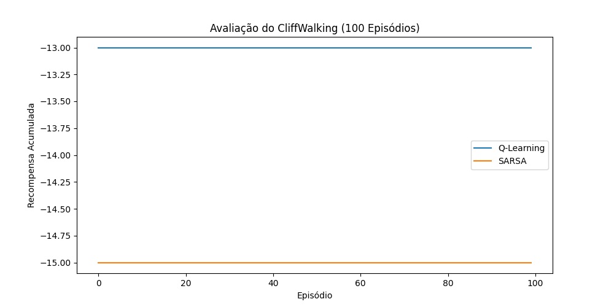
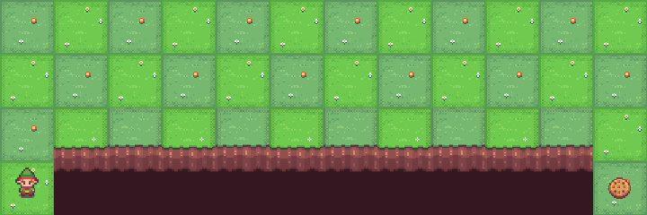
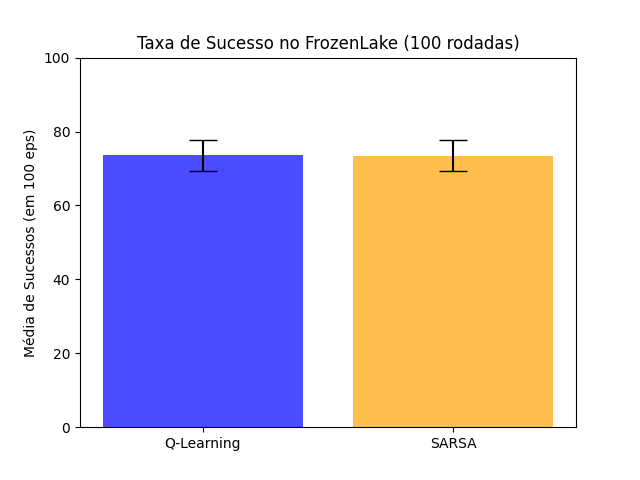
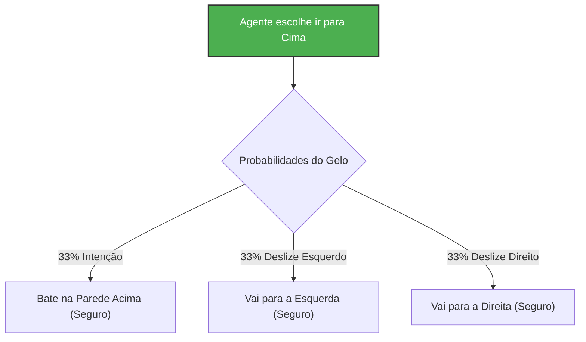

# APS 03 - Aprendizagem por Reforço

**Autores:** Maria Eduarda Oliveira Galdino e Adrielle Gabriel Santana

Este repositório contém a implementação dos algoritmos Q-Learning e SARSA para os ambientes `CliffWalking` e `FrozenLake` da biblioteca Gymnasium, desenvolvidos como parte da APS 03 da disciplina.

## Estrutura do Projeto

- `src/agents.py`: Implementação das classes base para os agentes Q-Learning e SARSA.
- `src/cliff_walking.py`: Script de treinamento, avaliação e geração de GIFs para o ambiente CliffWalking.
- `src/frozen_lake.py`: Script de treinamento e avaliação estocástica (100 runs x 100 episódios) para o ambiente FrozenLake.
- `img/`: Diretório contendo os gráficos e GIFs gerados pelos agentes.

## Como Executar

Certifique-se de ter o Python instalado. É fortemente recomendado criar e ativar um ambiente virtual (virtualenv) antes de instalar as dependências.

No Windows, abra o terminal na pasta do projeto e execute:
```bash
python -m venv venv
.\venv\Scripts\activate
```

Em seguida, com o ambiente ativado (você verá um `(venv)` no terminal), instale as dependências:

```bash
pip install gymnasium[toy-text] numpy matplotlib imageio tqdm
```

Para reproduzir os resultados do **CliffWalking**, execute:

```bash
python src/cliff_walking.py
```
Isso gerará os GIFs dos agentes treinados e o gráfico de recompensas na pasta `img/`.

Para reproduzir os resultados do **FrozenLake**, execute:

```bash
python src/frozen_lake.py
```
Isso exibirá a taxa de sucesso após 100 rodadas de 100 episódios e imprimirá as Q-Tables (políticas) preferidas no console.

---

## Respostas - Ambiente CliffWalking

**Gráficos e Animações Gerados:**

*Gráfico de Recompensas da Avaliação (100 episódios):*


*Animação do Q-Learning (caminho ótimo, porém rente ao penhasco):*


*Animação do SARSA (caminho seguro, distante do penhasco):*


**1. Qual algoritmo, Q-Learning ou SARSA, apresentou um comportamento mais seguro em relação ao penhasco? Justifique sua resposta com base nos resultados obtidos.**

O algoritmo **SARSA** apresentou um comportamento mais seguro. 

| Algoritmo | Recompensa de Avaliação | Rota Escolhida | Risco |
|-----------|-------------------------|----------------|--------|
| **Q-Learning** | -13 | Caminho mais curto (rente ao penhasco) | ⚠️ Alto |
| **SARSA** | -15 a -17 | Caminho longo (afastado do penhasco) | ✅ Seguro |

Ao analisar os GIFs e as rotas dos agentes, nota-se que o agente treinado com SARSA aprende uma rota que passa longe da beirada do penhasco. Isso se justifica porque o SARSA é um algoritmo *on-policy*, o que significa que ele avalia e atualiza os valores de ação ($Q(s,a)$) com base na política que está sendo executada no momento, incluindo os passos aleatórios da exploração epsilon-greedy ($\epsilon$). Como a exploração perto do penhasco frequentemente resulta em quedas (recompensa de -100), o SARSA penaliza o caminho mais curto e descobre que a rota pelo topo do grid tem um retorno esperado maior e mais seguro.

**2. Se houver diferenças significativas entre as políticas de ação dos agentes treinados com Q-Learning e SARSA, explique por que elas podem ter ocorrido.**

A diferença central se deve à natureza *off-policy* do Q-Learning comparada à *on-policy* do SARSA. 
O Q-Learning atualiza seus valores assumindo que a próxima ação será sempre a *ação ótima* (usando `max Q`), ignorando as ações exploratórias aleatórias que o agente de fato tomará durante o treinamento. Por causa disso, o Q-Learning não penaliza a rota próxima ao penhasco, pois "acredita" que o agente não fará movimentos aleatórios que o derrubariam. Isso resulta no aprendizado do caminho mais curto possível, rentes ao abismo. Já o SARSA considera os movimentos reais do agente (incluindo a aleatoriedade e os "tropeços" em direção ao penhasco durante o treino), levando o agente a ser mais cauteloso e a aprender uma política que se afasta do perigo. Durante o teste (onde a exploração $\epsilon$ é 0), o Q-Learning faz o caminho rente sem cair (pois o ambiente é determinístico), mas sua política aprendida assume riscos maiores que a do SARSA.

---

## Respostas - Ambiente FrozenLake

**Resultados da Execução (100 rodadas de 100 episódios):**
```text
Q-Learning Successes: Média = 73.55, Desvio Padrão = 4.16
SARSA Successes: Média = 73.49, Desvio Padrão = 4.29

Política de Ação Preferida - Q-Learning:
L U U U
L H R H
U D L H
H R D G

Política de Ação Preferida - SARSA:
L U U U
L H L H
U D L H
H R D G
```

**1. Qual algoritmo, Q-Learning ou SARSA, treinou o melhor agente para o ambiente FrozenLake? Justifique sua resposta com base nos resultados obtidos.**



Ambos os algoritmos treinaram agentes de qualidade muito similar, e poderíamos considerá-los praticamente equivalentes no ambiente `FrozenLake` escorregadio. 
Nos testes de 100 rodadas de 100 episódios, tanto o Q-Learning quanto o SARSA apresentaram uma média de sucessos na faixa de 73% a 74%, com desvios padrões próximos. Diferente do CliffWalking, o ambiente FrozenLake padrão é não-determinístico (escorregadio). Logo, os passos arriscados são frequentemente penalizados pelo próprio ambiente, forçando ambos os algoritmos a adotarem caminhos mais seguros e similares para maximizar os sucessos a longo prazo.

**2. Se houver diferenças significativas entre as políticas de ação dos agentes treinados com Q-Learning e SARSA, explique por que elas podem ter ocorrido. Considere a natureza não determinística do ambiente FrozenLake em sua resposta.**

*Para facilitar a visualização, abaixo estão as políticas mapeadas em um grid visual 4x4 (onde S=Start, H=Hole, G=Goal):*

**Política Q-Learning:**
| ⬅️ S | ⬆️   | ⬆️   | ⬆️   |
|------|------|------|------|
| ⬅️   | 🕳️ H | ➡️   | 🕳️ H |
| ⬆️   | ⬇️   | ⬅️   | 🕳️ H |
| 🕳️ H | ➡️   | ⬇️   | 🏁 G |

**Política SARSA:**
| ⬅️ S | ⬆️   | ⬆️   | ⬆️   |
|------|------|------|------|
| ⬅️   | 🕳️ H | ⬅️   | 🕳️ H |
| ⬆️   | ⬇️   | ⬅️   | 🕳️ H |
| 🕳️ H | ➡️   | ⬇️   | 🏁 G |

Ao imprimir a Q-Table mapeada como direções, observamos que as políticas são praticamente idênticas. Diferenças ocorrem apenas em estados onde as ações possuem retornos esperados e níveis de segurança idênticos.
No FrozenLake, se o agente tentar ir em uma direção, ele só tem 33% de chance de efetivamente ir naquela direção; os outros 66% fazem o agente deslizar ortogonalmente. Dessa forma, a incerteza constante do ambiente mascara a diferença clássica entre *off-policy* e *on-policy* (que causou as diferenças brutas no CliffWalking). Ambos os algoritmos percebem a alta probabilidade de cair em buracos mesmo quando tomam a "ação ótima", e por isso ambos convergem para a política que evita ficar de frente com os buracos nas direções ortogonais aos movimentos.

**3. Explique a política de ação preferida por cada agente em um estado específico do ambiente FrozenLake. Justifique por que cada agente pode ter desenvolvido essa política com base no algoritmo utilizado e na natureza do ambiente.**

Podemos analisar o estado inicial **(0,0)**, localizado no canto superior esquerdo. 
A lógica natural diria para o agente tentar ir para a direita ('R') ou baixo ('D') para se aproximar do objetivo no canto inferior direito. No entanto, a política aprendida por ambos os algoritmos no estado (0,0) muitas vezes indica **'L' (Esquerda)** ou **'U' (Cima)**.

**Justificativa:** 

**Dinâmica de Escorregamento Explicada (Exemplo em (0,1)):**


Devido à natureza não determinística (piso escorregadio), o comando de movimento resulta em 1/3 de ir na direção desejada e 2/3 de ir nas direções perpendiculares. 
Se o agente estivesse no estado **(0,1)** e tentasse ir para a Direita ('R'), haveria 1/3 de chance de deslizar perpendicularmente para Baixo ('D') direto no buraco em (1,1). Para mitigar isso, em (0,1), a melhor ação aprendida é 'U' (Cima), pois bater na parede (Cima) mantém o agente na casa, e os deslizamentos ortogonais ('L' e 'R') fazem-o navegar com segurança pela borda sem qualquer risco de cair no buraco abaixo.
Seguindo essa lógica que se retropropaga, no estado inicial **(0,0)**, forçar propositalmente o agente nas paredes (tentando 'L' ou 'U') é uma forma altamente segura de usar os escorregões (deslizamentos ortogonais) para se mover pelo mapa. Ao fazer isso, o agente minimiza qualquer chance de o vento/gelo arrastá-lo acidentalmente para a direção de uma armadilha logo no começo, provando que o agente aprendeu a usar o piso escorregadio a seu favor.
